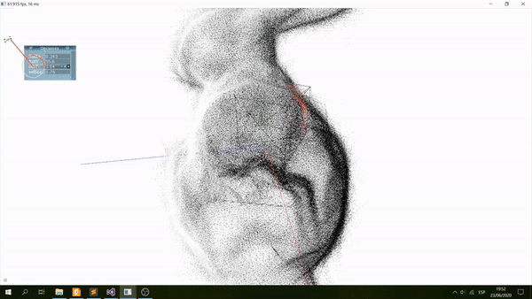
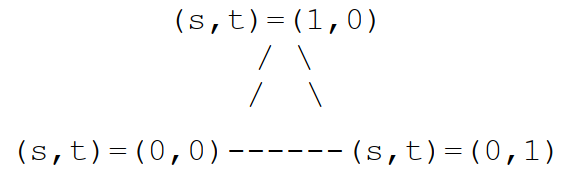

# Exploding Bunny
OpenGL app that shows the explosion effect of an object using C++ and GLSL. Most of the computations are performed in the geometry shader. It uses the parametric coordinates of the triangles for subdividing them N times and translate the new produced vertices over time. It uses the centroid of the triangles as reference for the direction vectors of traslation for each new vertex. giovanny.jtt@gmail.com

[Video Demo Link https://youtu.be/FPhnLEm4NMk](https://youtu.be/FPhnLEm4NMk)

# GLSL Program Description

General description of the code. You can find also comments in all shader files.

* Steps performed for getting the explosion effect
    * Set `V0` as original position of `vertices[0]` of the triangle
    * Set `V01` and `V02` as vectors on the triangle plane (from vertices[0] to vertices[1] and vertices[2] respectively)
    * Compute normal vector of the triangle as vector product between `V01` and `V02`
    * Compute centroid of triangle
    * Set number of layers as `numLayers = 2 ^ uLevel`, where uLevel is number of times for repeating the subdivision
    * Set deltas of displacement (`dt` and `ds`) for the parametric coordinates of the triangle (`s` and `t`)
    * For each subdivision
        * Call `produceVertex` passing parametric coordinates values depending on the subdivision
            * Coordinates of new vertex will computed as `vec3 v = V0 + s*V01 + t*V02`
        * Example of parametric coordinates:
            * 
        * Set direction vector for displacing every new vertex using the triangle centroid as origin reference
        * Compute the final position of the new vertex taking into account the translation units `uT` and the velocity factor `vel`
        * (Optional) Clipping vertices against a cube
            * All vertices inside the cube will be removed (not sent to fragment shader)
                * It uses the angles among auxiliar vectors (from the center of every cube-side to the vertex) and the cube-side normals.
                * The vertex will be considered inside the cube when all `cos` are `<= 0`
                * The clipped vertices will be `rendered` with red color
